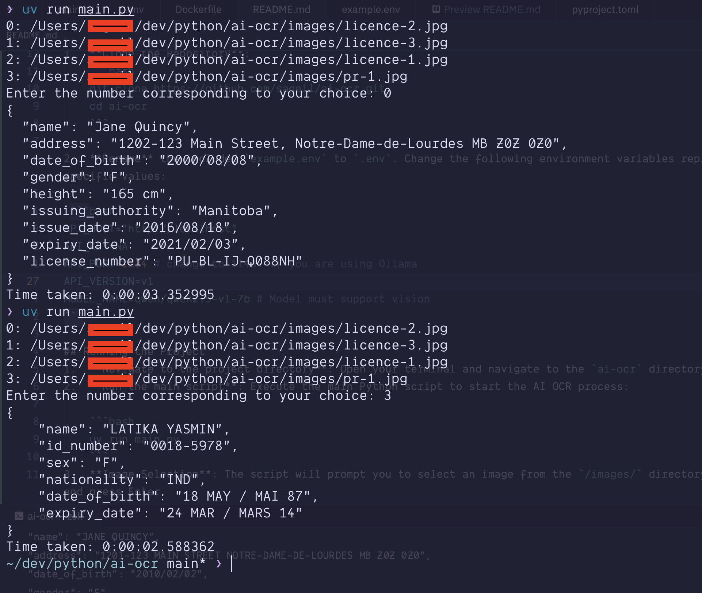

# AI OCR Setup Instructions

OpenAI compatible local LLM-based OCR tool using LM Studio or Ollama

## Prerequisites

1. **lm Studio** [https://lmstudio.ai/download](https://lmstudio.ai/download) or **Ollama** [https://ollama.com/download](https://ollama.com/download)
2. **Python 3.13+**: Make sure you have Python 3.13 or a later version installed on your system. You can check your Python version by running `python --version` or `python3 --version` in your terminal.
3. **uv**: recommended Python package manager. You can install it from [https://docs.astral.sh/uv/getting-started/installation/](https://docs.astral.sh/uv/getting-started/installation/)
4.  **vision enabled model**: This project uses `qwen/qwen2.5-vl-7b` Try it online [https://huggingface.co/spaces/GanymedeNil/Qwen2-VL-7B](https://huggingface.co/spaces/GanymedeNil/Qwen2-VL-7B). To use with **LM Studio** download it from [https://lmstudio.ai/models/qwen/qwen2.5-vl-7b] (https://lmstudio.ai/models/qwen/qwen2.5-vl-7b) and to use **Ollama** install it from [https://ollama.com/library/qwen2.5vl](https://ollama.com/library/qwen2.5vl)
5.  **Environment Variables**: The project relies on environment variables for configuration.

## Installation Steps

1.  **Clone the Repository**:
    ```bash
    git clone https://github.com/sageil/ai-ocr.git
    cd ai-ocr
    ```

2.  **Rename** the included `example.env` to `.env`. Change the following environment variables replacing the default values with your environment's specific values:

 ```bash
API_HOST="http://localhost"
API_KEY=NA
API_PORT=1234 # change to 11434 if you are using Ollama
API_VERSION=v1
MODEL_NAME=qwen/qwen2.5-vl-7b # Model must support vision
```

## Running the Project using Docker
1.  **Navigate to the project directory**: Open your terminal and navigate to the `ai-ocr` directory.
2.  **Build** the image using  `docker image build -t aiocr .`
3.  **Run** the container using `docker container run --rm --network host -it --name aiocr aiocr:latest`

## Running the Project Locally
1.  **Navigate to the project directory**: Open your terminal and navigate to the `ai-ocr` directory.
2.  **Run the main script**: Execute the main Python script to start the AI OCR process:

    ```bash
    uv run main.py
    ```
3.  **Image Selection**: The script will prompt you to select an image from the `/images/` directory. Enter the number corresponding to your desired image and press Enter.
4.  **OCR Processing**: The script will send the selected image to OpenAI's API for OCR processing.
5.  **Output**: The extracted text from the image will be printed to your terminal in JSON format.

## Directory Structure

*   `ai-ocr/`: Root directory of the project
    *   `main.py`       : Main Python script for running the AI OCR process.
    *   `images/`       : Directory containing images to be processed.
    *   `example.env`   : env file containing default configurations

## Screen Capture

## Troubleshooting

*   **Missing Dependencies**: If you encounter errors related to missing dependencies, ensure that you have installed all the required packages using `uv sync --active`.
*   **Image Format**: Ensure that the images you are using are in a supported format (e.g., jpg).
*   **Model Support**:  Ensure the `MODEL_NAME` environment variable is set to a model that supports vision.

## Disclaimer:
All of the images attached to this repo are example documents found online.
